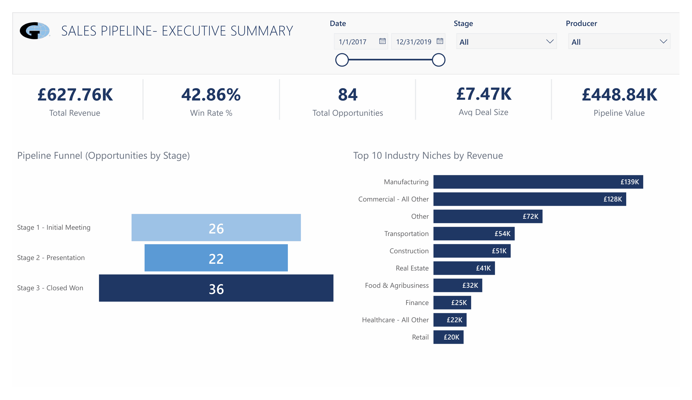
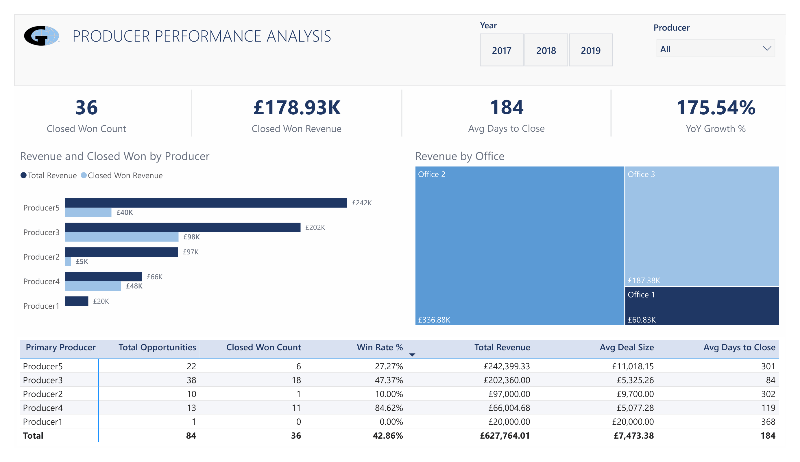
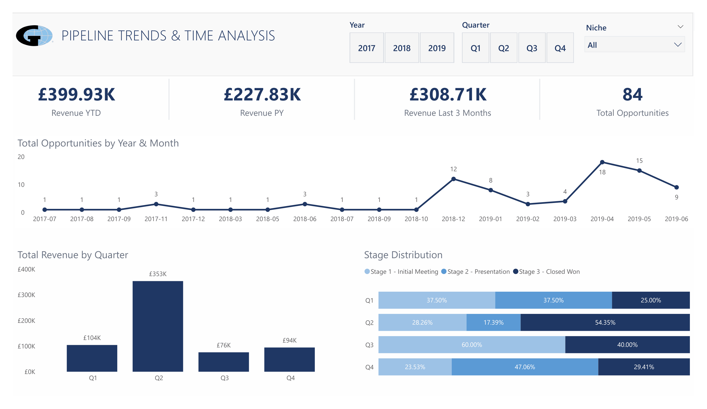

# 🏢 Gallagher Insurance — Sales Pipeline Analysis
### End-to-End Power BI Project | Data Cleaning · Star Schema · DAX · Executive Reporting

<br>


---

## 📋 Project Overview

This project is an **end-to-end insurance sales pipeline analysis** built for Gallagher Insurance as part of a technical assessment for an Analyst role (2–4 years experience).

The project covers every stage of a professional BI workflow:

| Stage | What was done |
|-------|--------------|
| **Data Profiling** | Column statistics via Power Query — errors, nulls, distinct counts, min/max identified before any transformation |
| **Data Cleaning** | Power Query (M language) — structured, dependency-aware transformation sequence applied column by column |
| **Data Modelling** | Star schema — 1 fact table, 3 dimension tables, integer foreign keys, DAX Calendar table |
| **DAX Measures** | 13 measures across 3 groups: Base/Rate, Time Intelligence, and a Valid Dates base measure |
| **Reporting** | 3 executive-level report pages with cross-page slicer sync |

---

## 📊 Report Pages

### Page 1 — Executive Summary
> *"What is the overall pipeline performance?"*

- 5 KPI Cards: Total Revenue · Win Rate % · Total Opportunities · Avg Deal Size · Pipeline Value
- Pipeline Funnel showing deal count by stage
- Top 10 Industry Niches by Revenue (horizontal bar chart)
- Slicers: Date range · Stage · Producer

### Page 2 — Producer Performance Analysis
> *"Who are the top performers and which office leads?"*

- 4 KPI Cards: Closed Won Count · Closed Won Revenue · Avg Days to Close · YoY Growth %
- Clustered bar chart: Total Revenue vs Closed Won Revenue per producer
- Treemap: Revenue by Office
- Performance Matrix: 6 measures per producer (Total Opportunities, Closed Won Count, Win Rate %, Total Revenue, Avg Deal Size, Avg Days to Close)
- Slicers: Year (tile) · Producer (dropdown)

### Page 3 — Pipeline Trends & Time Analysis
> *"How has the pipeline evolved over time?"*

- Line chart: Total Opportunities by Year & Month
- Column chart: Total Revenue by Quarter
- 100% Stacked bar: Stage Distribution by Quarter
- Time intelligence KPI cards: Revenue YTD · Revenue PY · Revenue Last 3 Months · Total Opportunities
- Slicers: Year (tile) · Quarter (tile) · Niche (dropdown)

---

## 🔑 Key Insights

- **42.86% win rate** across 87 total opportunities (2017–2019)
- **Q2 2019 spike**: £353K revenue in Q2 alone — 56% of total annual revenue
- **Producer4** has the highest win rate at **84.62%** (11/13 deals closed) despite lower total revenue
- **Producer5** generates the highest revenue (£242K) but the lowest win rate (27.27%) — large, complex, slow-moving deals
- **Manufacturing** (£139K) and **Commercial - All Other** (£128K) are the top two revenue-generating niches
- **175.54% YoY growth**: 2019 pipeline activity was dramatically higher than 2018

---

## 🗂️ Repository Structure

```
Gallagher-Sales-Pipeline-PowerBI/
│
├── README.md
│
├── Dataset/
│   └── Dataset.xlsx                    # Original raw source file (unmodified)
│
├── PowerBI/
│   └── Gallagher_Sales_Pipeline.pbix   # Complete Power BI report
│
├── Screenshots/
│   ├── 01_Executive_Summary.png
│   ├── 02_Producer_Performance.png
│   └── 03_Pipeline_Trends.png
│
└── Documentation/
    ├── Data_Dictionary.md
    └── Cleaning_Log.md
```

---

## 🧹 Data Cleaning Summary (Power Query)

The raw dataset had **180 rows** with multiple data quality issues across several columns.

### Issues Found During Profiling

| Column | Issue | Fix Applied |
|--------|-------|-------------|
| Date | Mixed types — invalid text values alongside valid DD/MM/YYYY dates | Force to Text → Replace invalids → Change Type with India Locale → Replace Errors → null |
| Expected Decision Date | Formula artefacts ("="), wrong locale | Same approach as Date column |
| Annual Revenue | 6 error-state cells (#VALUE! from broken Excel formulas) | Replace Errors → null (not 0 — see reasoning below) |
| Niche Affiliations | Error-state #NAME? cell, blank/null values | Replace Errors first (before Trim) → "Other", then nulls → "Other" |
| Stage Name | Long inconsistent strings | Dynamic stage number extracted via Text.BeforeDelimiter — stored as StageID integer |
| Opportunity Name | Trim only — no capitalisation applied | Preserves business acronyms (IASME, CBCP etc.) |

### Cleaning Order (dependency-aware)

The order of operations matters. Each step depends on the previous one:

```
Step 1:  Replace Errors on Niche Affiliations (error-state cells — must come before Trim)
Step 2:  Trim + Clean all text columns
Step 3:  Fix Annual Revenue — Replace Errors → null → change type to Fixed Decimal Number
Step 4:  Fix Date — Text → Replace invalids → Locale (UK) → Replace Errors → null
Step 5:  Fix Expected Decision Date — same approach as Date
Step 6:  Fix Niche Affiliations remaining nulls/blanks → "Other"
Step 7:  Standardise Stage Name — extract StageID dynamically using Text.BeforeDelimiter
Step 8:  Remove duplicates (two-stage: exact match then business-key)
Step 9:  Add Opportunity_ID surrogate key (always AFTER deduplication)
Step 10: Add Is_Closed_Won flag
Step 11: Merge Fact with Dim_Producers → bring in Producer_ID → remove Primary Producer text column
Step 12: Merge Fact with Dim_Accounts → bring in Account_ID → remove Account Name text column
```

**Why null and not 0 for missing revenue?**
Null = revenue not recorded. Zero = actual revenue of zero. Using 0 distorts AVERAGEX — avg(10000, 0, 5000) = 5000 vs avg(10000, null, 5000) = 7500. Null is analytically honest.

### Deduplication Approach

Two-stage deduplication:
1. **Exact match** on all columns after cleaning — removes rows that became identical after fixing mixed revenue and date formatting (180 → 93 rows)
2. **Business-key dedup** on Account Name + Opportunity Name — Stage, Revenue, and Date treated as mutable attributes that can change over time (93 → 87 rows)

**Final clean dataset: 87 rows · 0 errors across all columns**

> Note: 3 rows contain null dates. These were retained because the opportunity and revenue data remain valid. They are excluded only from time-intelligence calculations using a dedicated `Total Revenue (Valid Dates)` base measure.

---

## 🗃️ Data Model — Star Schema

```
                    [ Calendar ]
                         │ 1
                         │
[ Dim_Producers ] ─── [ Fact_Opportunities ] ─── [ Dim_Accounts ]
      1 │                     ★                         │ 1
        │                     │
        │               [ Dim_Stage ]
                              1

All relationships: Many-to-One · Single cross-filter direction
```

### Tables

| Table | Type | Rows | Purpose |
|-------|------|------|---------|
| Fact_Opportunities | Fact | 87 | One row per sales opportunity — all measures and foreign keys |
| Dim_Producers | Dimension | 5 | Producer names, office locations, Producer_ID |
| Dim_Accounts | Dimension | 77 | Account names, Acct_ID, primary office |
| Dim_Stage | Dimension | 3 | StageID mapped to stage labels — controls funnel sort order |
| Calendar | Date Table | ~1,000 | One row per date — drives all time intelligence |

### Relationships

| From (Fact ★) | To (Dim 1) | Key Columns | Cardinality |
|---------------|-----------|-------------|-------------|
| Fact_Opportunities | Calendar | Date → Date | Many-to-One |
| Fact_Opportunities | Dim_Producers | Producer_ID → Producer_ID | Many-to-One (Integer) |
| Fact_Opportunities | Dim_Accounts | Account_ID → Acct_ID | Many-to-One (Text) |
| Fact_Opportunities | Dim_Stage | Stage_ID → StageID | Many-to-One (Integer) |

**Why integer foreign keys?**
Text-based joins risk silent mismatches from whitespace differences. Integer joins are more reliable and performant. Stage_ID was extracted dynamically from the stage string. Producer_ID was created via an index column on Dim_Producers. Account_ID was merged in from Dim_Accounts on Account Name.

---

## 📐 DAX Measures

All 13 measures stored in a dedicated `_Measures` table.

### Base and Rate Measures

```dax
Total Revenue =
    SUM(Fact_Opportunities[Annual_Revenue])

Total Opportunities =
    COUNTROWS(Fact_Opportunities)

Closed Won Count =
    CALCULATE(COUNTROWS(Fact_Opportunities), Fact_Opportunities[Is_Closed_Won] = 1) + 0

Closed Won Revenue =
    CALCULATE([Total Revenue], Fact_Opportunities[Is_Closed_Won] = 1)

Pipeline Value =
    CALCULATE([Total Revenue], Fact_Opportunities[Is_Closed_Won] = 0)

Win Rate % =
    DIVIDE([Closed Won Count], [Total Opportunities], 0)

Avg Deal Size =
    DIVIDE([Total Revenue], [Total Opportunities], 0)

Days to Close =          -- calculated column, not a measure
    VAR Days = DATEDIFF(Fact_Opportunities[Date], Fact_Opportunities[Expected_Decision_Date], DAY)
    RETURN IF(Days < 0, BLANK(), Days)

Avg Days to Close =
    ROUND(AVERAGE(Fact_Opportunities[Days to Close]), 0)
```

### Time Intelligence Measures

```dax
-- Base for time intelligence only (excludes 3 null-date rows)
Total Revenue (Valid Dates) =
    CALCULATE([Total Revenue], NOT(ISBLANK(Fact_Opportunities[Date])))

Revenue YTD =
    TOTALYTD([Total Revenue (Valid Dates)], 'Calendar'[Date])

Revenue PY =
    CALCULATE([Total Revenue (Valid Dates)], SAMEPERIODLASTYEAR('Calendar'[Date]))

Revenue Last 3 Months =
    CALCULATE(
        [Total Revenue (Valid Dates)],
        DATESINPERIOD('Calendar'[Date], MAX(Fact_Opportunities[Date]), -3, MONTH)
    )

YoY Growth % =
    DIVIDE([Total Revenue (Valid Dates)] - [Revenue PY], [Revenue PY], 0)
```

**Why `Total Revenue (Valid Dates)` only for time intelligence?**
The 3 null-date rows have no position on the Calendar. Time intelligence functions shift date context — null-date rows have no date to shift. Snapshot measures (Closed Won Revenue, Pipeline Value, Win Rate %) use the full dataset because they do not depend on a date context.

---

## 🛠️ Tools & Technologies

| Tool | Usage |
|------|-------|
| **Power BI Desktop** | Data modelling, DAX, report pages |
| **Power Query (M)** | All data cleaning and transformation |
| **DAX** | 13 measures — base, rate, and time intelligence |
| **Microsoft Excel** | Source data (raw, unmodified) |

---

## 📸 Screenshots

### Page 1 — Executive Summary


### Page 2 — Producer Performance Analysis


### Page 3 — Pipeline Trends & Time Analysis


---

*Built with Power BI Desktop · Source: Gallagher Insurance CRM Export (2017–2019)*
